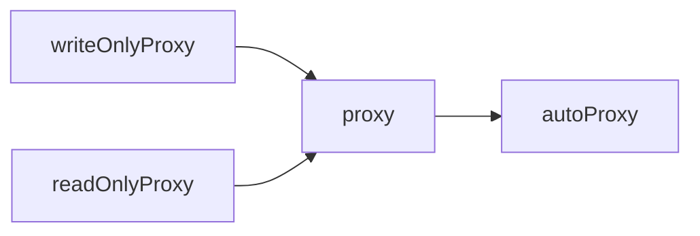
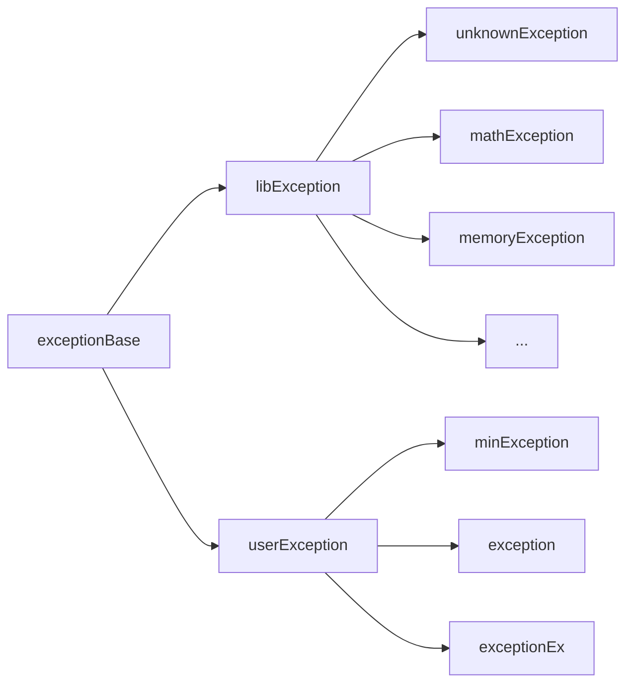

# Yumo win32 接口设计书

（草案第二版，2026年9月4日10:45分开始编写）

## 1. 总述

本设计书总结了截至到目前为止对 Yumo Win32 的所有设计，包括了绝大多数的类与部分函数的功能说明。本设计书阐明了库的总体架构，明确了库的大致设计，一些并不重要但可能存在的辅助类、大量辅助性或非必要的函数、大量非基础性非必要性的方法都将不会在本设计书内呈现，大量简化使用的宏、内联函数、常量、typedef不在本设计书的考虑范围内，上述内容将不会在本设计书内做出主要呈现，但可能会在一些部分呈现一些已有的设想。

由于本设计书是仅设计的，具体的实现方法并不会在本设计书中指定，文中给出的所有代码实现均为可能的实现，实际开发中应当根据真实情况决定最终实现。

## 2. 文档约定

`?`在某些情况下是描述符，用于描述一些设计时不应该指定的内容，比如，一个接口接收字符串，设计书不应当指定是`wchar_t*`还是`std::wstring`亦或其他，就会使用`?`加描述性文本替代，具体的：

```cpp
?字符串 interface(?字符串 arg1);
```

后文中不会对`?`的使用再做特别解释。

`*`在某些情况下是占位符，通常用于描述一类内容，比如一些具有相同前/后缀的功能相近的同系列接口

```cpp
// count* 接口
countWindow();
countElement();
countData();
// ....
```

由于可能和指针搞混，后文大多会做出解释

## 3. 项目定位

本项目（指Yumo win32，以下以“本项目”、“项目”或“本库”代称）是对 Win32 API 的现代化便利化封装，使用 [C++17](https://en.cppreference.com/cpp/17) 为核心标准，并为 [C++20](https://en.cppreference.com/cpp/20) 及其以上的标准版本提供基于新特性的更便利更安全的开发接口。（如使用`concept`约束模板参数）

本项目计划是纯头文件的项目，所有头文件使用`.hpp`后缀命名，放置于项目的`include/yumo`目录下，同时提供`include/yumoWin32.hpp`引入所有头文件以便用户便捷的引入。

项目的核心宗旨：不惜牺牲性能换取便利的图形界面开发体验，高度封装功能并向用户隐藏底层细节。

项目有意去模仿易语言，很多功能会去刻意对标易语言。（未来甚至会出现纯中文接口版，然后可能会有日语版俄语版等等...）

## 4. 项目开发计划

计划中的开发分为三期。分别用于基础实现、进阶实现、完全实现。

- 在项目的一期工作中，将会让库拥有开发基本窗口、使用基本控件的能力，截止到本设计书编写开始时，项目仍处于这一阶段的设计工作中。
- 在项目的二期工作中，库将逐步壮大以支持更丰富的显示效果，比如分层窗口等更加自定义化的呈现形式将会被添加到库中。
- 在项目的三期工作中，库将收入更多与窗口关联不大的API，如文件读写、时钟、编码转换，将这些非图形化显示功能的 Windows API 并入库中。

## 5. 编码规范

为了获取更加统一的编码风格，本文将给出已经确定的编码规范，在下一版设计书中，这一部分将被移除并独立为一个单独的文档，但在当前版本中将合并呈现。

由于本库是 Yumo 库集体系下的一个库，本库的命名空间使用`yumo::win32::`，所有公开接口都应置于其中。

综合考量了支持库、功能等因素，库的所有文件均以 UTF-8 编码，因必要程序不支持而不得不采用 UTF-8 with BOM、GBK 等编码的情况除外。

所有公开接口无论是类名、函数名、参数名、类成员、枚举成员均采用小驼峰命名法且均需具有实际可读的语义，如`setAllWindowAttribute(bool sign,attribute showAttribute);`；所有常量采用以下划线分割的大小写形式，如`SYSTEM_ARGUMENT`。

对于库内定义的、具有长生命周期的变量、类、函数、枚举等，也应当拥有以小驼峰命名法命名的有实际意义的名称，但是对于一些内部存在的函数、模板等中一些拥有极短的生命周期或在所处语境下极易推导语义的内容，可以采取不规范的命名，比如给一个短小的模板帮助函数的模板参数类型起名为`T`，给一个拥有三条语句长度的循环体的循环使用名为`c`的变量记录循环次数。

对于所有公开的接口，以doxygen风格注释标记其用途、参数、返回值、注意事项等内容，对于内部类、变量、函数等，可以采用任意风格的注释。

对于一定长度的函数调用，应考虑分行，如下所示：

```cpp
aVeryLongFunction(
    arg1, arg2, arg3,
    arg4, arg5 //
);
```

这里的`//`是防止有些IDE会自动的格式化代码并将`);`自动收到上一行去。

## 6. 核心概念

库中有一些核心概念不易被理解或可能存在歧义，本文段主要负责对这些概念予以解释。

### 6.1. 窗口/控件信息类

库中提供了大量描述窗口、控件的信息类，这些类可以用于存储窗口信息，其内容是可复用的，将这些信息传递给`loadWindow()`等函数将会使用这些信息创建一个新的窗/控件。

信息类命名均带有`info`需要注意它只是一个类似初始化列表的结构而并不会与实际的窗口相关联，真正有关联的是用它`load`后得到的窗口/控件对象。

### 6.2. 事件、事件处理程序与事件表

每一次鼠标点击，键盘输入，对于 Yumo win32 均算作一个“事件”，当事件发生时，库会调用预先由用户注册给这一事件的事件处理程序，类似于回调函数

事件与事件处理程序的相应关系由事件表负责记录，每个信息结构（准确地讲，对于信息结构，其管理的是事件信息表，这个在后面的内容中展开），窗口/组件类均各自持有一个事件表。

### 6.3. 代理

代理（proxy）为程序的易用性提供了基础性的支持，它的更精确名称是“属性”（property），是库用于隐藏底层操作的工具。

代理的设计目的是为了模仿VB、易语言与等更高级的语言的“属性”机制，一个很好的例子是窗口标题属性，使用了代理的窗口类标题成员在行为上可以视为一个`std::wstring`，但是实际上，在赋值时，代理调用 Win32 API 完成了编码转换等工作并调用相应函数设置了窗口标题，读取时，代理又通过 API 读到了当前标题并完成了编码转换等工作，通过代理的包装，借助窗口/控件类对窗口/控件的操作被伪装成了对窗口/控件的直接操作，类被伪装成了窗口/控件本身。

### 6.4. 替代值

库内大多数接口接受的参数都不是普通类型，而是替代值模板类包装的数据类型，可以接受`usingDefault`、`usingEmpty`、`usingAuto`等类对象，实现自由默认值、自动值

可以写出这样的写法：

```cpp
yumo::win32::function(
    arg1,
    usingDefault(),
    arg3
);
```

该类弥补了 C++ 默认值必须连续省略的缺陷

具体见后文介绍

## 7. 核心接口

下面将介绍目前已经完成设计的核心接口，通过这些接口可以实现基本的图形化绘制。

### 7.1. windowInfoBase类

`windowInfoBase`是所有窗口/控件信息类的基类，包含了窗口/控件在创建载入前由用户指定的窗口信息，这些信息是窗口与各种控件普遍适用的（例如，x坐标是创建窗口/组件前可以预先确定且普遍适用的信息，而窗口句柄、对齐方式分别因创建前不确定和不具普遍性而不被包含）

`windowInfoBase`包含了如下成员：

- x（默认10）
- y（默认10）
- 高度（默认10）
- 宽度（默认10）
- 可视（默认真）
- 禁止（默认假）
- 鼠标指针（默认普通指针）

### 7.2. windowInfo类

`windowInfo`类继承自`windowInfoBase`，在其基础上增加了窗口的特有内容，包括：

- 标题（默认空）
- 位置（通常、居中、最大化、最小化，最大化不能有固定边框，默认居中）
- 边框（默认普通固定边框）
- 底色（默认白色值+1）
- 最大化按钮禁用（默认真）
- 最小化按钮禁用（默认假）
- 所有控制按钮禁用（默认假）
- Esc关闭（默认真）
- 可移动（默认真）
- 任务栏中显示（默认真）
- 总在最前（默认假）
- 窗口类名（默认空，创建时库内分配）
- 图标（默认无）

`windowInfo`类私有的持有一个`elementInfoTable`成员，名为`elementInfoTable_`，详见[elementInfoTable类](#7.5.elementInfoTable类)

### 7.3. elementInfoBase类

`elementInfoBase`继承自`windowInfoBase`类，它在其基础上新增了对于控件来讲有共性但独立于窗口的信息（不过目前这些是空）

`elementInfoBase`提供一个静态的`convert`模板方法，模板参数为任意继承自`elementInfoBase`的类，接受一个类型为`elementInfoBase&`的参数，以实现安全的RTTI，比如，假设有`labelInfo`继承自`elementInfoBase`：

```cpp
labelInfo a{};
elementInfoBase& ref = a;
labelInfo& ref2 = elementInfoBase::convert<labelInfo>(a);
// 下面的写法将触发提示框并异常终止
otherInfo& ref3 = elementInfoBase::convert<otherInfo>(a);
```

此外，控件基类还提供了私有的`std::unique_ptr<elementBase> load(HWND parentHwnd);`虚成员函数，由继承的子类可以根据自身特性编写加载函数，用于`loadWindow`函数加载窗口时同步加载控件，因此`loadWindow`应当是`elementInfoBase`的友元（有关`element`，请参见[控件基类和控件类](#7.10.控件基类和控件类)）

### 7.4. *Info类

`*Info`类不是特指某个类，而是指一系列类，其中`*`是代表控件名的占位符，所有`*Info`继承自`elementInfoBase`并新增其特性属性，比如对于编辑框，有：

- 内容（默认空）
- 边框（默认普通固定边框）
- 文本颜色（默认黑色）
- 背景颜色（默认白色）
- 字体（默认优先级`微软雅黑->等线->黑体->系统默认`）
- 最大容许长度（默认为0即不受限）
- 允许多行（默认为假）
- 自动折叠（默认为假）
- 隐藏选择（默认为真）
- 滚动条（提供相应枚举，默认为无）
- 转换方式（大写小写互转，默认无）
- 输入方式（包括普通、只读、密码、整数、小数、日期时间，默认普通）
- 调节器（包括自动调节器\[底限到上限区间内以1递增递减\]，手动调节器\[提供调节钮按下事件\]，默认无调节器）
- 调节器底限值（默认0）
- 调节器上限值（默认100）

其他组件的属性请**在未来**参见控件属性文档。

所有`*Info`类均重载`std::unique_ptr<elementBase> load(HWND parentHwnd);`，以给定窗口句柄创建实际控件并返回。

### 7.5. elementInfoTable类

`elementInfoTbale`用于捆绑窗口信息类和控件信息类，由`windowInfo`类持有，记录所有附属于自身的组件。

类提供`add(?字符串 name,elementInfoBase&)`方法，用于添加新控件到窗口，其中的`name`将是未来操作控件的唯一凭据。

`elementInfoTbale`重载`[]`，接受一个字符串并以此在`name`中查找，返回结果，如果找不到，将触发弹窗提示并异常终止。

一个可能的实现是让`elementInfoTbale`私有继承自`std::map<?字符串,elementInfoBase&>`

需要注意的是，`elementInfoTable`需要提供至少一种遍历方式。

### 7.6. proxy系列类

`proxy`系列类用于实现代理，一版草案在第七节中给出了一个未经验证的可能的实现：

```cpp
struct proxyNoInfo {};
// 如果没有扩展信息，使用proxyNoInfo占位
template <typename T, typename exInfoT = proxyNoInfo>
class proxy {
public:
    using getter = std::function<T(const exInfoT&)>;
    using setter = std::function<void(const exInfoT&, const T&)>;
    // 构造函数，指定getter、setter、默认值、空值、扩展信息
    proxy (getter getterFunc,setter setterFunc,
           exInfoT exInfo = exInfoT{},
           T defaultValue = T{},T emptyValue = T{})
        : getter_(std::move(getterFunc)), setter_(std::move(setterFunc))
        , exInfo_(std::move(exInfo)), defaultValue_(std::move(defaultValue)), emptyValue_(std::move(emptyValue))
    {}

    // 禁止拷贝构造/拷贝赋值
    proxy(const proxy&) = delete;
    proxy& operator=(const proxy&) = delete;

    // 允许移动
    proxy(proxy&&) = default;
    proxy& operator=(proxy&&) = default;

    // 隐式转换
    operator T() const {
        return getter_(exInfo_);
    }

    // 隐式赋值
    proxy& operator=(const T& value) {
        setter_(exInfo_, value);
        return *this;
    }
    proxy& operator=(T&& value) {
        setter_(exInfo_, std::move(value));
        return *this;
    }

    // 使用默认值/空值
    proxy& operator=(const usingDefault&) {
        setter_(exInfo_, defaultValue_);
        return *this;
    }
    proxy& operator=(const usingEmpty&) {
        setter_(exInfo_, emptyValue_);
        return *this;
    }

private:
    getter getter_;
    setter setter_;
    exInfoT exInfo_;
    T defaultValue_;
    T emptyValue_;
};
```

这段代码涉及`usingDefault`和`usingEmpty`类，具体参见[替代值类](#7.12.替代值类)

实现时可以参考这个实现，但需要注意这个实现并没有经过足够的测试，也没有足够的安全性、兼容性与效率考量，需要谨慎对待。

当前存在的一个设想是，使用以下的继承关系：



具体的实现最后由实现人员决定，本设计书仅负责提出可能的方案。

### 7.7. loadWindow函数

`?返回值 loadWindow(windowInfo&);`用于根据窗口信息加载实际窗口，创建`window`类对象，该函数在加载完窗口后会遍历其`elementInfoTable_`成员，调用其中包含的所有`*Info`成员的`load`方法，并将返回的控件类与对应的`name`写入`elementTable`（有关`window`、控件类和`elementTable`，请见下面的内容）

注意这里返回值不是确定的，原因是`window`类设计上是窗口类，其很多功能只有在事件处理程序中使用才有意义，但是考虑用户有可能有加载完成时先获取一些加载前无法获取的信息的需求，比如获取句柄，出于灵活性上考虑，也许可以提供一个类似`loadedWindowInfo`的类，具体是叫什么、包含什么、有什么功能或是直接设为返回`void`由最终实现人员敲定。

### 7.8. windowBase类

`windowBase`类与`windowInfoBase`对应，是窗口/控件类的基类，其中包含了一些使用proxy系列类定义的成员，包括：

- x
- y
- 高度
- 宽度
- 可视
- 禁止
- 鼠标指针

这些成员的初始值来自创建了它的info对象中对应的值。

`windowBase`提供一个静态的成员函数充当窗口过程，用于转发到对应类事件表的`onMessage`，一个可能的方案是让windowBase提供一个onMessage虚函数并让所有窗口/控件类实现这一虚函数，借此窗口过程将消息分发给类，类再分发到事件表的`onMessage`。

`windowBase`公开一个`convert(windowBase&);`模板静态方法，以便RTTI，这和`windowInfoBase::convert`是相似的

> [!note]
> 上述可能实现是在没有明确最终实现前提下的猜想，这种猜想建立在每个窗口/控件类都定义了独特的继承于`eventTableBase`的类的假设前提下，实际包含关系可能不是如此或不仅仅如此。

### 7.9. eventTableBase类

事件表基类记录了窗口/控件的所有共性事件的事件处理程序，这些事件包括：

- 创建完毕
- 将要销毁
- 被激活
- 被取消激活
- 位置改变
- 尺寸改变
- 空闲
- 首次激活
- 被显示
- 被隐藏

类提供一个`onMessage`方法，该方法具有保护的访问权限，接收的参数和win32窗口过程接收的参数一样，这些参数由其子类转发，类处理完自身关心的事件并包装派发给事件处理后等待返回，随后将返回值返回。如果消息不是其支持的事件对应的消息或消息对应的事件没有注册处理程序，类将此消息转发至`DefWindowProc`并返回。

所有事件处理程序的记录成员均为公有，一个可能的实现是使用`std::function`：

```cpp
public:
    std::function<void()> willBeDestroyed = nullptr;
```

### 7.10. window类

`window`类是通过`loadWindow`获取的实际窗口，该类的构造器函数是不公开的，只能由`loadWindow`构造并管理。

`window`重载`[]`操作符以简化控件获取操作，返回一个`elementRef`中间类，再由该类隐式转换为对应的类，具体参照对应文段。

### 7.11. 控件基类和控件类

和 info 体系相对应，有`elementBase`继承自`windowBase`；有各种元素类继承自`elementBase`。

所有元素定义继承自`eventTableBase`的`*::eventTable_`类并以之为`eventTable`的成员的类型。`*::eventTable_`使用`*::eventTable_::onMessage`覆盖`eventTableBase::onMessage`，接受的参数与之相同，`*::eventTable_`记录了各种窗口/组件的特性事件，包括鼠标点击、内容改变等等，具体请**在未来**参见组件事件文档。

`*::eventTable_::onMessage`仅处理、派发这些新增的特性事件，当消息不再当前类支持范围内，则转交`eventTableBase::onMessage`，如果支持但未被注册，则转交`DefWindowProc`。

### 7.12. 异常类

有时，库会向用户抛出异常；有时，用户应当向库抛出异常，本库的所有异常均继承自`exceptionBase`类及其子类，具体如下：



其中，`exceptionBase`是一个空的类，仅用于串联两支异常体系。

`libException`是库抛出的异常，包含一个私有`wchar_t*`和一个公开的`what`方法，由此衍生出了各种继承的异常类以适应不同场景和不同捕获需求。

`userException`用于用户在一些用户抛出异常库捕获的场景中使用，不同的类将产生不同弹窗与日志输出，继承的`minException`不包含任何成员，`exception`和`libException`相近，`exceptionEx`采用`std::wstring`替换了`wchar_t*`。

### 7.13. 替代值类

库有三种替代值类，`usingDefault`、`usingEmpty`、`usingAuto`，并预定义了`defaultValue`、`emptyValue`、`autoValue`三个成员，三个类均为空类，具体使用参见本文给出的`proxy`可能实现中的最后两个`operator=`重载`。

自动值较为特殊，初期可不实现，主要用途是用于一些可以自动推导值的场景，比如将编辑框长宽设为自动，库会根据文本长度等自动计算。

### 7.14. 包装类

这个类是本文档编写至一半时追加的，在前面内容中可能有细微出入，请自行辨析。

包装类类似于代理类，也是隐式的构造、赋值、转换，用于支持默认值、空值、自动值，除此之外没有其他功能。

比如这样的一个接口：

```cpp
int interface(wrapper<int,10,0>arg);
```

下面两个代码框中的写法是等价的

```cpp
interface(usingDefault());
interface(usingEmpty());
```

```cpp
interface(10);
interface(0);
```

考虑到 C++17 中模板类不能使用对象作为模板参数，如果将默认值和空值作为模板参数进行设置，则该类不可用于类的传递，所有类需要提供`operator=`来处理自动值、空值，一些无法控制的类比如 STL 提供的类可能需要其他的设计。

### 7.15. 处理事件

考虑到用户的事件处理程序可能耗时很长，需要效仿易语言为用户提供类似`处理事件（）`这样的接口，提供使用这一接口，处理程序将不阻塞消息循环，一个可能的实现是沿用易语言的实现：

1. 挂起当前事件处理程序，这一点只要在接口内不返回即可实现
2. 建立新的临时消息循环
3. 分发消息直到消息队列为空
4. 返回

和易语言一样，这个实现无法避免重入，需要在用户文档中预先告知

### 7.16. elementRef中间类

`elementRef`中间类用于控件引用的返回，其支持隐式转换为任意elementRef子类，同时进行检测以确保RTTI安全进行。

> 注：该类为后期追加，可能会直接取代`elementBase::convert`

## 8. 事件处理接口契约

事件处理程序需要满足以下原型：

```cpp
using namespace yumo;
win32::result eventProcess(window&,....){...} 
```

返回一个`result`值，该值仅为`HRESULT`的 typedef ，库的消息循环最终将此值返回给操作系统。

需要接收一个`window`类的引用，以此操作窗口，通过这种方式，可以在不更换事件处理程序的情况下重复创建窗口。

---

（第二版草案到此完）

2026年 9月5日
+0800 11:20 a.m. 编写完毕

2026年 9月25日
+0800 11:18 p.m. 录入完毕

2026年 10月2日
+0800 4:08 a.m. 第一次修改